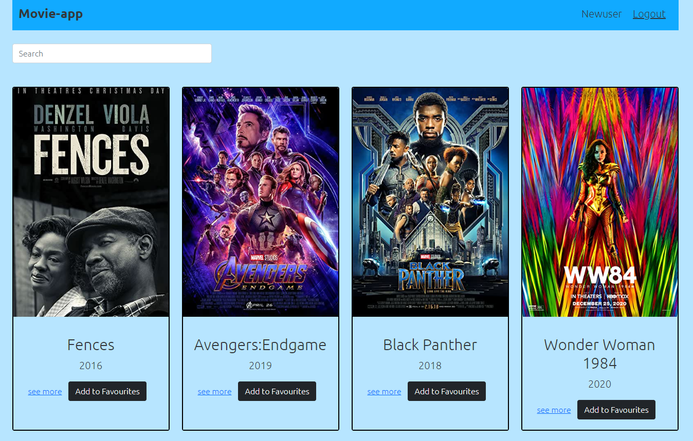

# movie-app-client

The client-side of my movie app. The app will display a list of all movies available in the database to the users. Users will be able to search movies by title, genre and director. Users will also be able to register, create a list of favourite movies, delete favourite movies and deregister from the app.

## Tools

- React
- React-Redux
- Parcel
- Javascript
- React- Bootstrap
- Redux
- HTML
- CSS
- React-Router-Dom
- Moment

## Usage

After cloning the repository, apply the following steps
- To install Parcel v2 or recent, run "npm install -g parcel@next" 
- To start the local server, run "npm run start"
- Open the local server on the browser 

## Contributions

- Pull requests are welcome

[visit the webpage](https://movie-app-client.netlify.app/)

